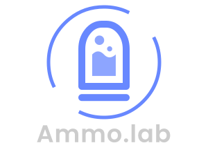

Based on, Under permission granted by license by <a target="_blank" href="http://lo-th.github.io/Ammo.lab/">lo-th</a>, creator of; 

 

Advanced 3d physics lab 
use last version of <a target="_blank" href="https://github.com/kripken/ammo.js">ammo.js</a> made by Kripken 
for view i use three.js and sea3d on my <a target="_blank" href="https://github.com/lo-th/lab">lab libs</a>  
Demo on worker with code editor 
 
<a target="_blank" href="http://lo-th.github.io/Ammo.lab/">START</a> 

 
<h1> UPDATE </h1>
Is time to switch ES6 worker version with the last Ammo 3.0 :) 
go to new <a target="_blank" href="https://github.com/lo-th/phy">PHY repro</a>
 
 
<b>NO</b> modifiques los archivos de javascript <i>(*.js)</i> que son módulos o contienen urls no relativas al root <i>(/*)</i>